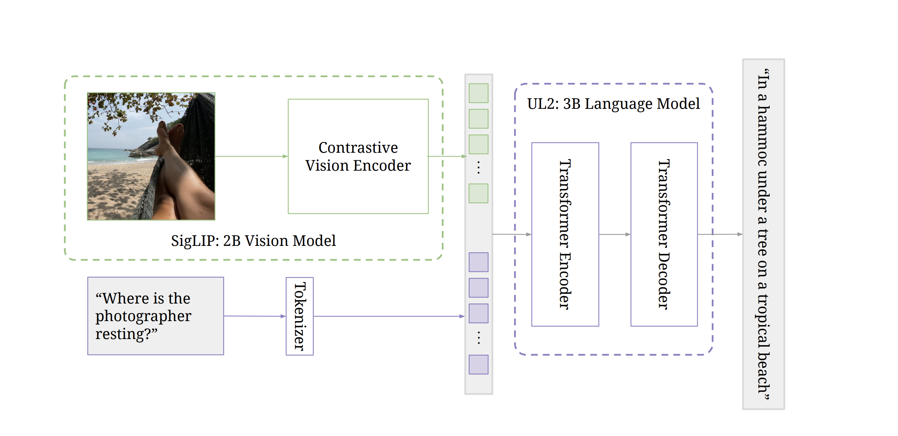

[](https://discord.gg/qUtxnK2NMf)

# Pali3


"Figure 1: Overview of the PaLI-3 (5B) model: images are encoded into visual tokens individually
by the contrastively pretrained 2B SigLIP vision model. Along with a query, these visual tokens
are passed to an 3B encoder-decoder UL2 Transformer which produces the desired answer."


Vit trained with siglip loss -> embeddings -> ul2 -> text tokens

text -> tokenizer -> embeddings -> ul2 -> text tokens


--------

## Installation

`pip install pali3`

-------

## Usage:

```python
import torch
from pali3.main import Pali3

model = Pali3()

img = torch.randn(1, 3, 256, 256)
prompt = torch.randint(0, 256, (1, 1024))
mask = torch.ones(1, 1024).bool()
output_text = torch.randint(0, 256, (1, 1024))

result = model.process(img, prompt, output_text, mask)
print(result)


```

-------

## Architecture

Here is the ASCII representation of the model architecture and the stages of training:

```
Model Architecture:

Image Input
    |
    V
Contrastive Vision Encoder (ViT-G/14)
    |
    V
Transformer Encoder
    |
    V
Transformer Decoder
    |
    V
Text Output

Stages of Training:

Stage 0: Unimodal pretraining
    |
    V
Stage 1: Multimodal training
    |
    V
Stage 2: Resolution increase
    |
    V
Task specialization (transfer)

```

The model architecture consists of a contrastive vision encoder (ViT-G/14) that encodes the image into tokens. These tokens are passed to a transformer encoder and then to a transformer decoder that generates a text output.

The training procedure consists of multiple stages:

-   Stage 0: Unimodal pretraining. The image encoder is pretrained contrastively on image-text pairs from the web, following the SigLIP training protocol. The text encoder-decoder is a 3B UL2 model trained following the mixture of denoisers procedure.

-   Stage 1: Multimodal training. The image encoder is combined with the text encoder-decoder and trained on a multimodal task and data mixture, keeping the image encoder frozen and using its native resolution.

-   Stage 2: Resolution increase. The resolution of the model is increased by fine-tuning the whole model with a short curriculum of increasing resolutions.

-   Task specialization (transfer). Finally, for each individual task, the model is fine-tuned with frozen ViT image encoder on the task's training data.

Please note that this is a high-level representation and the actual implementation might involve more details and complexities.


------

# Vit
Here are the ASCII diagrams for the ViT (Vision Transformer)

```
ViT (Vision Transformer):

Image Input
    |
    V
Patch Extraction
    |
    V
Linear Embedding
    |
    V
Positional Encoding
    |
    V
Transformer Encoder Blocks (Multiple Layers)
    |
    V
Classification Head (Optional)
    |
    V
Output (Image Embeddings)

```

The ViT starts with patch extraction from the input image. These patches are then linearly embedded and positional encodings are added. The resulting sequence of patch embeddings is passed through multiple layers of transformer encoders. Optionally, a classification head can be added at the end to get class probabilities for image classification tasks. The output of the ViT is the image embeddings.

-------

# UL2 Encoder/Decoder Transformer
```
Encoder-Decoder Architecture:

Input (Image + Text Tokens)
    |
    V
Transformer Encoder
    |
    V
Encoder Output (Context for Decoder)
    |
    V
Transformer Decoder
    |
    V
Output (Generated Text)

```

The encoder-decoder architecture starts with the input, which is a combination of image and text tokens in this case. The input is passed through a transformer encoder, which generates a context for the decoder. The transformer decoder then uses this context to generate the output text.

-----

# License
MIT

# Todo

- [x] Implement sig_lip vit model with training recipe
- [x] Implement the text tokenizer, maybe use token monster 
- [x] Implement the UL2 Transformer Encoder and Decoder
- [ ] Implement the pooling layer after vit then linear
- [ ] Implement the prepending the visual token embeddings to the text embeddings
- [ ] Implement training scripts for the full pali3 model
